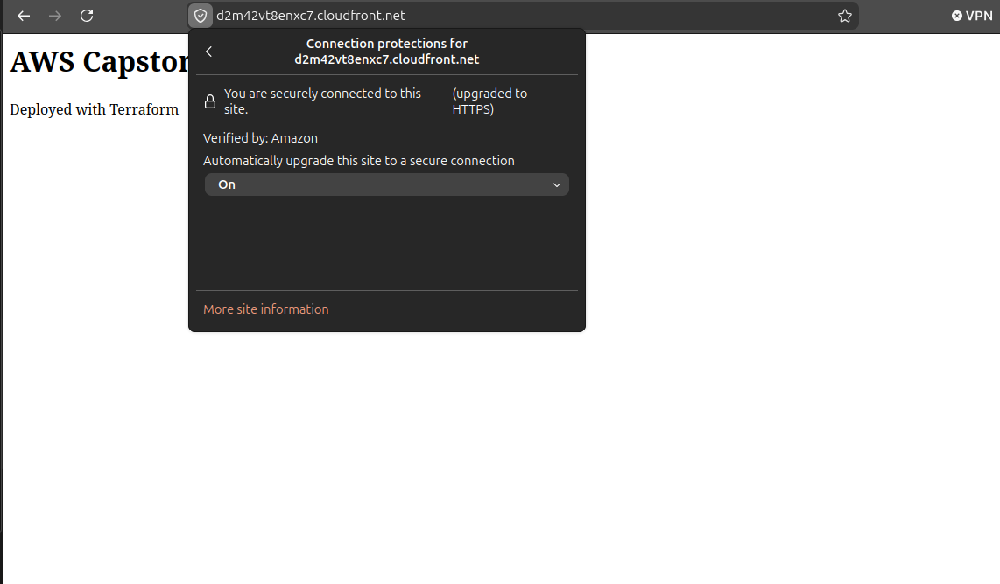
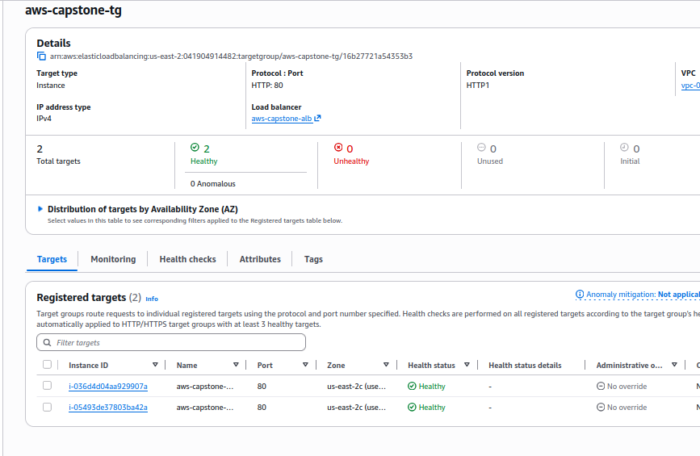
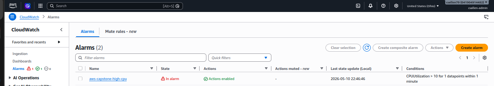

# ☁️ AWS Cloud Portfolio

Welcome to my AWS Cloud Portfolio repository. This repository contains hands-on cloud projects built to strengthen my skills in cloud infrastructure, networking, Linux administration, Infrastructure as Code (IaC), monitoring, and cloud operations using Amazon Web Services (AWS).

The goal of this portfolio is to demonstrate practical cloud engineering and cloud support skills through real-world style projects and operational troubleshooting scenarios.

---

# 🧠 Skills Demonstrated

- AWS EC2
- AWS CloudFront
- AWS Application Load Balancer (ALB)
- AWS CloudWatch
- AWS SNS
- Terraform Infrastructure as Code (IaC)
- Linux Administration
- Apache Web Server
- Cloud Networking
- Monitoring and Alerting
- Load Balancing
- Multi-Instance Architectures
- Operational Troubleshooting
- SSH Administration

---

# 🚀 AWS Projects

| Project | Description |
|---|---|
| AWS Project 1 | EC2 Linux web server deployment |
| AWS Project 2 | Static website hosting and CloudFront CDN |
| AWS Project 3 | Event-driven AWS architecture project |
| AWS Project 4 | Terraform Infrastructure Deployment |
| AWS Capstone | Secure multi-instance AWS architecture using Terraform, CloudFront, ALB, CloudWatch, and SNS |

---

# 🌟 Featured Capstone Project

## ☁️ AWS Secure Web App Capstone

This capstone project demonstrates a layered AWS architecture using:

- Terraform Infrastructure as Code
- CloudFront HTTPS content delivery
- Application Load Balancer
- Multiple EC2 backend web servers
- CloudWatch monitoring
- SNS email alerting
- Linux operational testing

### Architecture

```text
User
 ↓
CloudFront HTTPS CDN
 ↓
Application Load Balancer
 ↓
EC2 Web Server 1
EC2 Web Server 2
```

### Key Concepts Demonstrated

- Infrastructure as Code
- Traffic routing
- Backend redundancy
- Monitoring and alerting
- Operational troubleshooting
- Layered cloud architecture
- Linux administration

---

# 📸 Featured Screenshots

## CloudFront Secure Webpage


## ALB Target Instances


## CloudWatch Alarm Triggered


---

# 🎯 Career Focus

This portfolio was built to strengthen practical cloud engineering, cloud support, and cloud operations skills using AWS technologies and Infrastructure as Code practices.

---

# 📚 Ongoing Learning Goals

Future areas of study and projects include:

- AWS Auto Scaling
- Docker and Kubernetes
- Advanced Terraform
- CI/CD Pipelines
- Monitoring and Automation
- Multi-Cloud Architectures
- Cloud Security
- Serverless Architectures

---

# ✅ Summary

This repository represents my hands-on AWS cloud learning journey through practical projects focused on infrastructure deployment, networking, monitoring, troubleshooting, automation, and operational cloud concepts.
