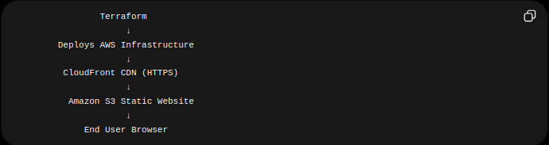
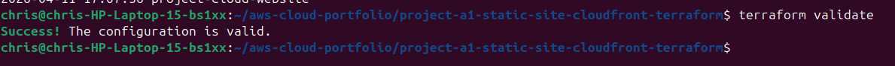
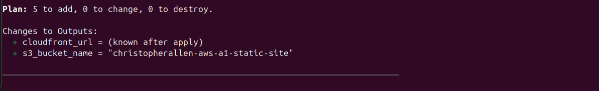
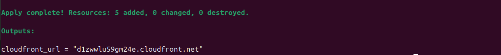
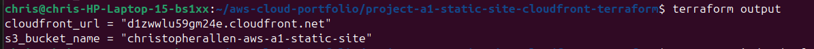
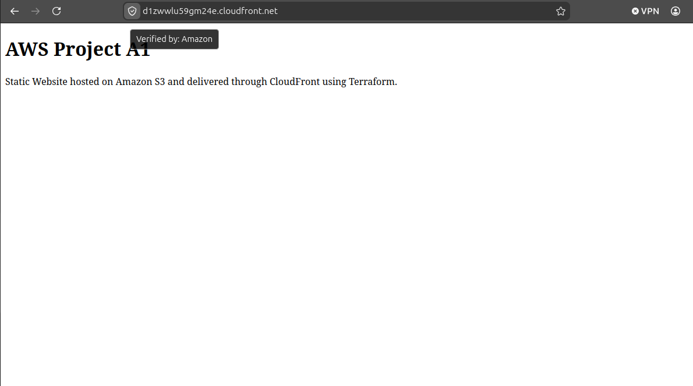

# ☁️ AWS Project A1 — Static Website + CloudFront + Terraform

## 📌 Project Overview

This project demonstrates how to deploy a static website using Amazon S3 and distribute content globally using Amazon CloudFront. Infrastructure was provisioned entirely with Terraform to demonstrate Infrastructure as Code (IaC) practices.

The project includes:
- Amazon S3 static website hosting
- Amazon CloudFront CDN distribution
- Terraform-based infrastructure deployment
- AWS CLI authentication
- Public bucket policy configuration
- HTTPS content delivery through CloudFront

---

## 🧠 Skills Demonstrated

- Infrastructure as Code (Terraform)
- AWS S3 Static Website Hosting
- Amazon CloudFront CDN
- AWS CLI Configuration
- Terraform Planning and Deployment
- Public Access Configuration
- Content Delivery Networks (CDN)
- Cloud Infrastructure Automation

---

## 🛠️ Technologies Used

- Amazon Web Services (AWS)
- Terraform
- Amazon S3
- Amazon CloudFront
- AWS CLI
- Linux (Ubuntu)
- Git & GitHub

---

## ⚙️ How It Works

1. Terraform authenticates to AWS using AWS CLI credentials.
2. Terraform provisions an S3 bucket configured for static website hosting.
3. A public bucket policy allows website access.
4. CloudFront is deployed in front of the S3 website endpoint.
5. Website files are uploaded to the S3 bucket.
6. CloudFront caches and securely distributes the content globally.

---

## 🏗️ Architecture Diagram

---

## 🖼️ Screenshots

### Terraform Validation

### Terraform Plan

### Terraform Apply

### Terraform Outputs

### Live Terraform Website

---

## 🔑 Key Takeaways

- Terraform allows infrastructure deployment through reusable code.
- CloudFront improves global website performance and HTTPS delivery.
- S3 can host static websites without traditional web servers.
- AWS CLI credentials are required for Terraform AWS authentication.
- Infrastructure planning with `terraform plan` helps prevent deployment mistakes.

---

## ❓ Interview Questions

### What is Infrastructure as Code (IaC)?
Infrastructure as Code is the process of provisioning and managing infrastructure using code instead of manual configuration.

### Why use CloudFront with S3?
CloudFront provides caching, HTTPS delivery, lower latency, and global content distribution.

### What does Terraform plan do?
Terraform plan previews infrastructure changes before deployment.

### Why use a CDN?
A CDN improves website performance by caching content closer to users globally.

### What is the purpose of terraform.tfstate?
Terraform state tracks deployed infrastructure resources and mappings between code and real cloud resources.

---

## ✅ Summary

In this project, I used Terraform to automate deployment of a static website hosted on Amazon S3 and distributed through CloudFront. This project demonstrates foundational cloud engineering concepts including Infrastructure as Code, CDN configuration, AWS authentication, and automated infrastructure provisioning.
