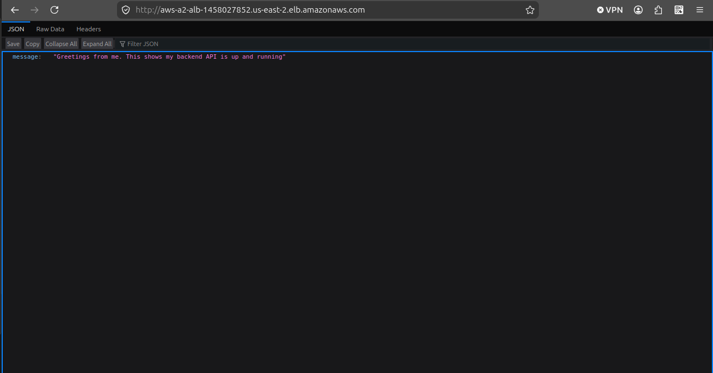
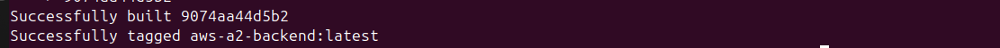
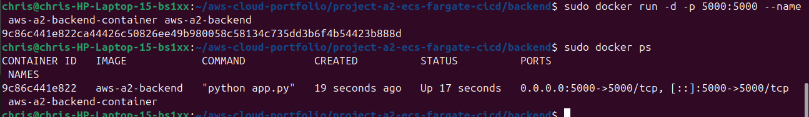
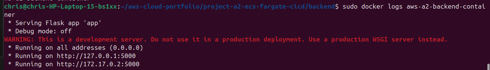
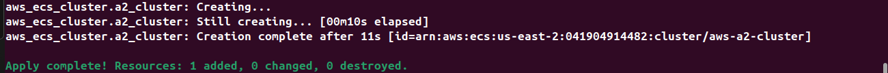
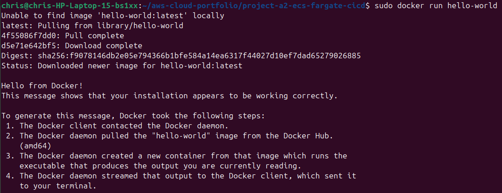
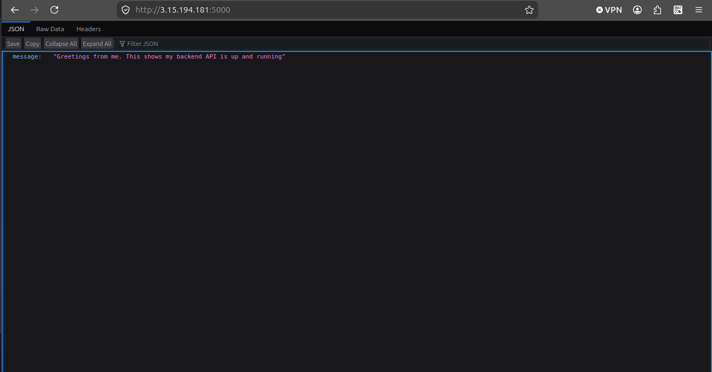

# ☁️ AWS Project A2 – ECS Fargate Deployment with Docker, ECR, ALB, and Terraform

## 📌 Project Overview

In this project, I built and deployed a containerized Flask application using AWS cloud services and Terraform.

This project introduced modern cloud-native deployment concepts including:

- Docker containers
- Amazon ECR
- ECS Fargate
- Application Load Balancer (ALB)
- Infrastructure as Code (Terraform)

Unlike earlier VM projects, this deployment used containers and orchestration services instead of manually configuring a server.

---

## 🧠 What I Learned

- How Docker containers work
- How container images are built and stored
- How ECS Fargate runs containers serverlessly
- How ALBs route traffic
- How Terraform automates infrastructure
- How cloud networking connects services together
- Basic DevOps-style deployment workflows
- Troubleshooting cloud infrastructure

---

# 🏗️ Architecture Diagram

```text
Internet
   │
   ▼
Application Load Balancer
   │
   ▼
ECS Fargate Service
   │
   ▼
Docker Container
   │
   ▼
Amazon ECR
```

---

## ⚙️ Technologies Used

| Technology | Purpose |
|---|---|
| Docker | Containerized the application |
| Amazon ECR | Stored Docker images |
| ECS Fargate | Ran containers |
| ALB | Routed traffic |
| Terraform | Automated infrastructure |
| Flask | Backend API |

---

## 🐳 Docker Commands

### Build Docker Image

```bash
docker build -t aws-a2-backend .
```

### Run Container

```bash
docker run -d -p 5000:5000 aws-a2-backend
```

### View Logs

```bash
docker logs CONTAINER_ID
```

---

## 📤 ECR Commands

### Authenticate Docker to AWS

```bash
aws ecr get-login-password --region us-east-2 | docker login --username AWS --password-stdin ACCOUNT_ID.dkr.ecr.us-east-2.amazonaws.com
```

### Push Docker Image

```bash
docker push ACCOUNT_ID.dkr.ecr.us-east-2.amazonaws.com/aws-a2-backend
```

---

## 🛠️ Terraform Configuration

### ECS Cluster

```hcl
resource "aws_ecs_cluster" "main" {
  name = "aws-a2-cluster"
}
```

### ECS Task Definition

```hcl
resource "aws_ecs_task_definition" "app" {
  family                   = "aws-a2-task"
  network_mode             = "awsvpc"
  requires_compatibilities = ["FARGATE"]
  cpu                      = "256"
  memory                   = "512"
}
```

### Application Load Balancer

```hcl
resource "aws_lb" "app" {
  name               = "aws-a2-alb"
  internal           = false
  load_balancer_type = "application"
}
```

---

## ▶️ Terraform Commands

### Initialize Terraform

```bash
terraform init
```

### Validate Terraform

```bash
terraform validate
```

### Deploy Infrastructure

```bash
terraform apply -auto-approve
```

### Destroy Infrastructure

```bash
terraform destroy -auto-approve
```

---

## 🌐 How the Deployment Worked

1. Docker packaged the Flask application into a container image
2. The image was pushed into Amazon ECR
3. ECS Fargate pulled the image from ECR
4. ECS launched the containerized application
5. The ALB exposed the application publicly
6. Terraform automated the infrastructure deployment

---

## 🔥 Skills Demonstrated

- Containerization
- Infrastructure as Code
- AWS networking
- Load balancing
- Cloud troubleshooting
- ECS deployments
- Terraform automation
- Docker workflows

---

## 🧩 Problems Encountered

During the project I encountered several troubleshooting scenarios including:

- ECS permissions issues
- ALB connectivity problems
- Terraform configuration mistakes
- Container networking issues
- Docker authentication problems
- Target group health check failures

Troubleshooting these problems helped reinforce cloud engineering concepts.

---

# 📸 Screenshots

## ALB Live API



---

## Docker Build Success



---

## Docker Container Detached Running



---

## Docker Container Logs



---

## Terraform ECS Cluster Created



---

## Docker Installation



---

## Docker Push to ECR


---

## ECS Fargate Live API



---

## 📚 Key Takeaways

- Containers improve portability and consistency
- ECR stores Docker images for deployment
- ECS Fargate removes server management responsibilities
- ALBs distribute incoming traffic
- Terraform automates infrastructure deployment
- Troubleshooting is a major cloud engineering skill

---

## 🎯 Interview Questions

### What is Docker?

Docker is a platform used to package applications and dependencies into portable containers.

### What is Amazon ECR?

Amazon ECR is AWS’s private Docker image registry.

### What is ECS Fargate?

ECS Fargate is a serverless container hosting service.

### What does an ALB do?

An Application Load Balancer distributes incoming traffic across healthy targets.

### Why use Terraform?

Terraform automates infrastructure deployment using code.

### What is Infrastructure as Code?

Infrastructure as Code is the practice of deploying infrastructure through configuration files instead of manual setup.

---

## 🏁 Summary

This project introduced modern cloud-native deployment methods using AWS.

The application was:

- containerized with Docker
- stored in Amazon ECR
- deployed with ECS Fargate
- exposed through an Application Load Balancer
- automated using Terraform

This project provided hands-on experience with:

- containers
- cloud networking
- infrastructure automation
- troubleshooting
- modern AWS deployment workflows

This was one of the first projects in my portfolio that demonstrated beginner DevOps and cloud engineering concepts used in real-world environments.
