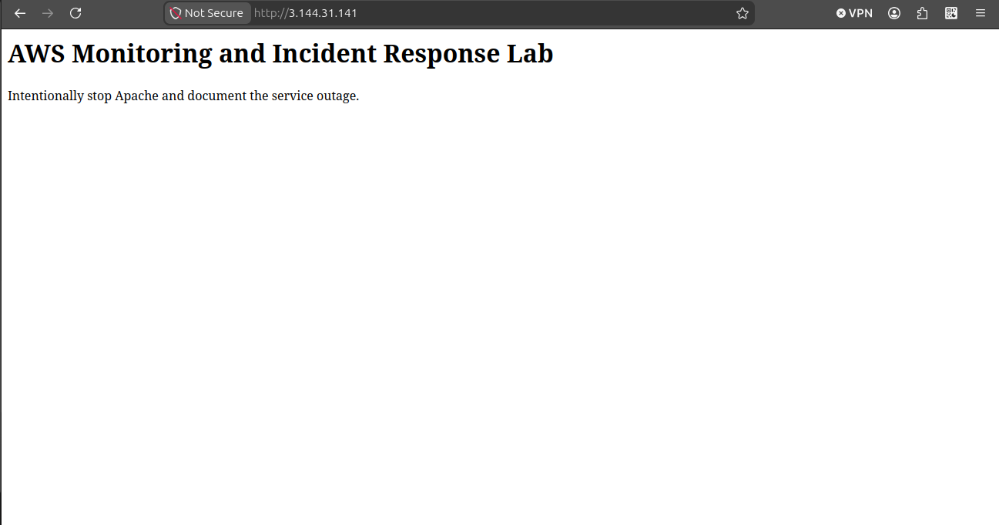
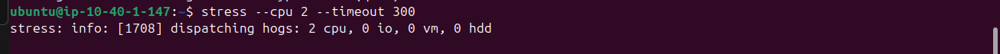
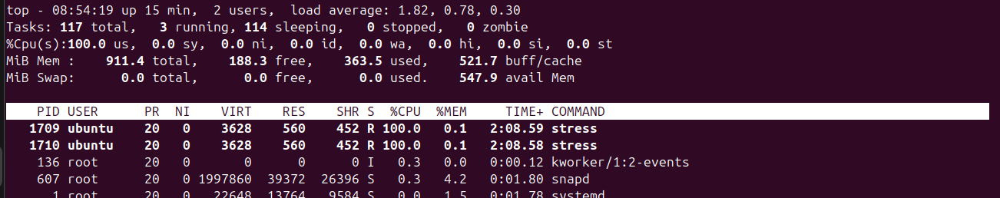
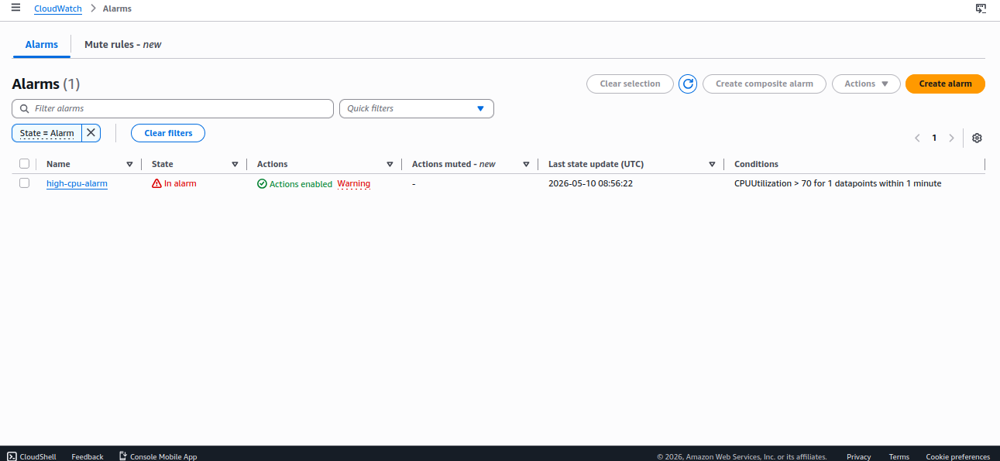
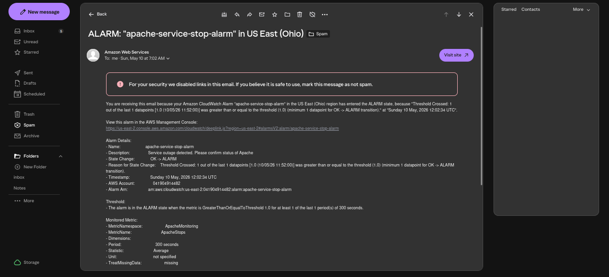
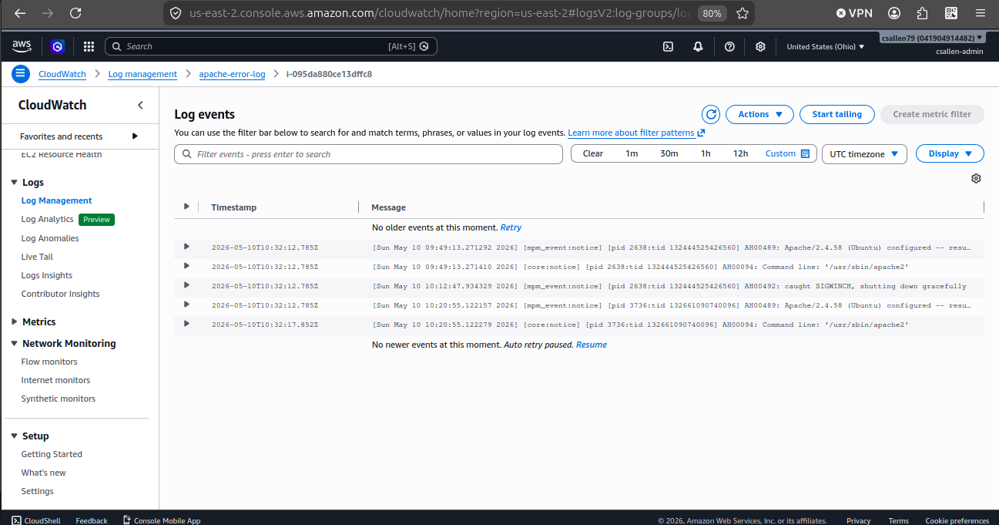
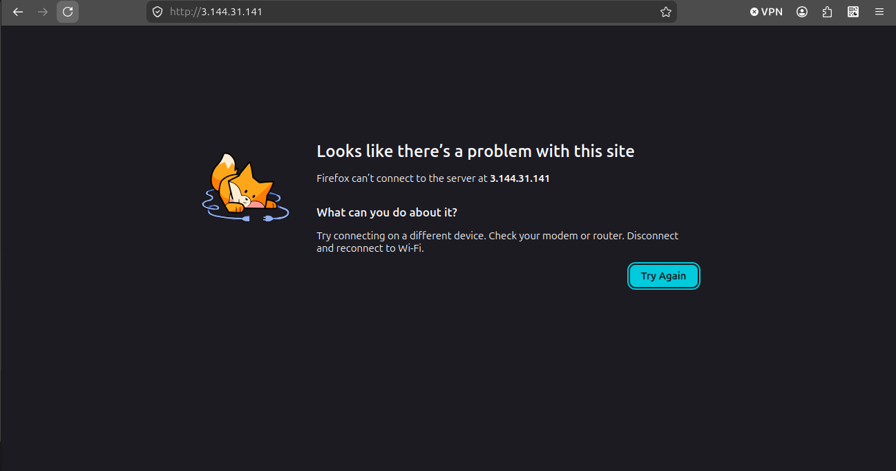
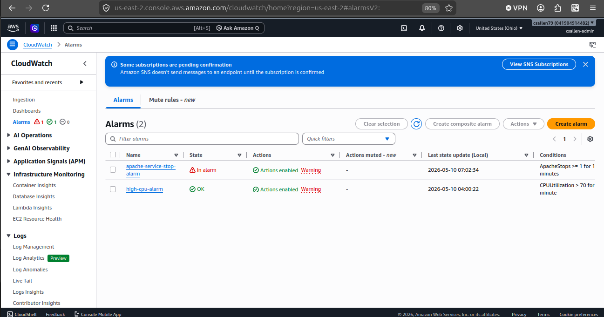

# 🚨 AWS Project 4 – Monitoring and Incident Response Lab

## 📌 Project Overview

This project focused on building a realistic cloud monitoring and incident response environment inside AWS using Terraform, CloudWatch, SNS, Apache, and CloudWatch Logs.

Instead of only deploying cloud resources, this lab simulated real operational workflows including:

* Infrastructure monitoring
* Application outage simulation
* CPU stress testing
* Alert generation
* Centralized logging
* Incident detection
* Email notification workflows
* Operational troubleshooting
* Service recovery validation

The goal of this project was to demonstrate operational cloud engineering concepts commonly used in:

* Cloud Operations
* NOC/SOC environments
* Infrastructure Support
* Cloud Support Engineering
* Monitoring and Incident Response
* Junior Cloud Operations roles

---

# 🏗️ Technologies Used

| Technology       | Purpose                              |
| ---------------- | ------------------------------------ |
| AWS EC2          | Hosted monitoring target server      |
| Terraform        | Infrastructure as Code deployment    |
| Apache2          | Simulated production web application |
| AWS CloudWatch   | Monitoring and alerting              |
| AWS SNS          | Email notifications                  |
| CloudWatch Agent | Centralized logging                  |
| CloudWatch Logs  | Log aggregation and analysis         |
| Metric Filters   | Log-based monitoring                 |
| Ubuntu Linux     | Server operating system              |
| SSH              | Remote administration                |

---

# 🧠 Skills Demonstrated

* Infrastructure as Code (IaC)
* Terraform deployment workflows
* Linux server administration
* SSH remote management
* Cloud monitoring concepts
* Incident response workflows
* Centralized logging
* CloudWatch metric creation
* SNS alert integration
* Troubleshooting and root cause analysis
* Application-aware monitoring
* Cloud infrastructure debugging

---

# 🏛️ Architecture Overview

```text
Terraform
    ↓
AWS Infrastructure Deployment
    ↓
EC2 Monitoring Server
    ↓
Apache Web Service
    ↓
CloudWatch Agent
    ↓
CloudWatch Logs
    ↓
Metric Filter
    ↓
CloudWatch Alarm
    ↓
SNS Email Notification
```

---

# ⚙️ Infrastructure Deployment

Terraform was used to deploy:

* Custom VPC
* Public subnet
* Route table
* Internet gateway
* Security group
* EC2 monitoring server
* CloudWatch alarms
* SNS topic
* Monitoring infrastructure

This project intentionally avoided relying on AWS default networking configurations in order to better demonstrate how cloud infrastructure components interact.

---

# 🌐 Apache Web Application

Apache2 was installed on the EC2 instance to simulate a production web service.

The webpage was customized to represent an operational monitoring environment.

This allowed the project to simulate:

* Service outages
* Application monitoring
* Incident detection
* Recovery workflows

---

# 📊 CPU Monitoring Simulation

A CPU stress test was performed using the Linux `stress` utility.

## Stress Test Command

```bash
stress --cpu 2 --timeout 300
```

This intentionally created high CPU utilization on the EC2 instance.

CloudWatch monitored the CPU metrics and triggered a CloudWatch alarm when utilization exceeded the configured threshold.

This simulated:

* Production server overload
* High CPU operational incidents
* Infrastructure monitoring workflows

---

# 📧 SNS Alerting Workflow

SNS (Simple Notification Service) was integrated with CloudWatch alarms.

When an alarm triggered:

```text
High CPU detected
        ↓
CloudWatch alarm triggered
        ↓
SNS email notification sent
        ↓
Operator receives alert
```

This simulated real operational alert delivery systems commonly integrated with:

* Email
* Slack
* PagerDuty
* ServiceNow
* Incident management platforms

---

# 📜 Centralized Logging

The CloudWatch Agent was installed on the EC2 instance.

Apache logs were forwarded into CloudWatch Logs using a custom agent configuration.

## CloudWatch Agent Responsibilities

* Read Linux log files
* Forward logs into CloudWatch
* Centralize operational logging
* Enable log-based monitoring

The following log file was monitored:

```text
/var/log/apache2/error.log
```

---

# 🔎 Metric Filter Monitoring

A CloudWatch metric filter was created to detect Apache shutdown events.

The filter matched the log pattern:

```text
shutting down gracefully
```

When detected:

```text
Apache stop log generated
        ↓
Metric filter matched event
        ↓
ApacheStops metric incremented
        ↓
CloudWatch alarm evaluated metric
        ↓
SNS notification sent
```

This demonstrated:

* Application-aware monitoring
* Log-based alerting
* Operational event detection

---

# 🚨 Incident Simulation

An intentional application outage was simulated by stopping the Apache service.

## Apache Stop Command

```bash
sudo systemctl stop apache2
```

This simulated:

* Application outage
* Service failure
* Production incident
* Web service downtime

CloudWatch Logs captured the shutdown event and generated a monitoring metric.

---

# 🔄 Incident Recovery

The Apache service was restored after the outage simulation.

## Apache Restart Command

```bash
sudo systemctl start apache2
```

This simulated:

* Incident recovery
* Service restoration
* Operational remediation
* Return-to-service workflows

---

# 🛠️ Troubleshooting and Lessons Learned

This project involved multiple realistic troubleshooting scenarios.

These issues significantly improved understanding of:

* AWS networking
* Terraform behavior
* IAM permissions
* CloudWatch architecture
* Monitoring workflows
* Infrastructure debugging

## 1. Invalid AMI ID

### Problem

Terraform failed because the AMI ID did not exist in the selected AWS region.

### Cause

AMI IDs are region-specific.

### Resolution

Updated the Terraform configuration to use a valid AMI for the active region.

---

## 2. Security Group / VPC Mismatch

### Problem

Terraform failed because the EC2 instance attempted to use a security group from a different VPC.

### Cause

The infrastructure configuration did not explicitly associate resources within the same custom VPC.

### Resolution

Updated Terraform networking resources so all infrastructure components referenced the correct VPC.

---

## 3. Unsupported Free Tier Instance Type

### Problem

Terraform deployment failed because the selected EC2 instance type was not free-tier eligible.

### Cause

The configured instance type exceeded AWS free-tier limitations.

### Resolution

Updated the instance type to a free-tier eligible option.

---

## 4. CloudWatch Logs Not Appearing

### Problem

Apache logs were not appearing inside CloudWatch Logs.

### Cause

The EC2 instance lacked IAM permissions required for CloudWatch logging.

### Resolution

Created an EC2 IAM role with:

```text
CloudWatchAgentServerPolicy
```

and attached it to the EC2 instance.

---

## 5. Metric Filter Not Triggering

### Problem

CloudWatch metrics were not incrementing after Apache shutdown events.

### Cause

The original metric filter pattern did not consistently match the Apache log entries.

### Resolution

Updated the filter pattern to:

```text
shutting down gracefully
```

which correctly matched Apache shutdown events.

---

## 6. Alarm Failed To Trigger

### Problem

The Apache alarm remained in an OK state even after the metric incremented.

### Cause

The alarm threshold was configured incorrectly.

### Resolution

Updated the alarm condition from:

```text
Greater than 1
```

to:

```text
Greater than or equal to 1
```

which allowed the alarm to trigger properly.

---

# 📷 Screenshots

## Custom Monitoring Webpage



---

## CPU Stress Test



---

## High CPU Monitoring



---

## CloudWatch Alarm Triggered



---

## SNS Email Notification



---

## CloudWatch Log Events



---

## Webpage Outage Simulation



---

## Alarm Recovery Validation



---

# 💼 Real-World Relevance

This project simulates multiple workflows commonly found in real operational environments:

| Real Operational Task     | Demonstrated In Project   |
| ------------------------- | ------------------------- |
| Infrastructure monitoring | CloudWatch CPU alarms     |
| Application monitoring    | Apache log monitoring     |
| Centralized logging       | CloudWatch Logs           |
| Alert delivery            | SNS email notifications   |
| Incident simulation       | Apache outage testing     |
| Troubleshooting           | Terraform/IAM/debugging   |
| Service recovery          | Apache restart workflows  |
| Monitoring validation     | Metric filters and alarms |

---

# 🧾 Key Takeaways

* Cloud infrastructure monitoring involves much more than deploying servers.
* Infrastructure and applications must both be monitored independently.
* IAM permissions are critical to AWS service integration.
* Centralized logging is a foundational operational capability.
* CloudWatch metric filters enable log-based alerting workflows.
* Incident response requires monitoring, detection, investigation, and recovery.
* Troubleshooting operational issues is a major part of cloud engineering work.

---

# 🎯 Summary

This project evolved from a simple monitoring lab into a realistic operational incident response environment.

The final environment demonstrated:

* Infrastructure deployment with Terraform
* Centralized logging
* Cloud monitoring
* Alert generation
* Incident simulation
* Application-aware monitoring
* Email notifications
* Troubleshooting workflows
* Service recovery

This project significantly strengthened practical understanding of how cloud monitoring and operational workflows function in real AWS environments.
