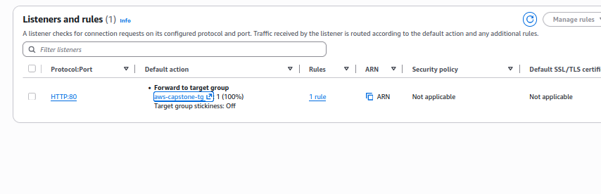
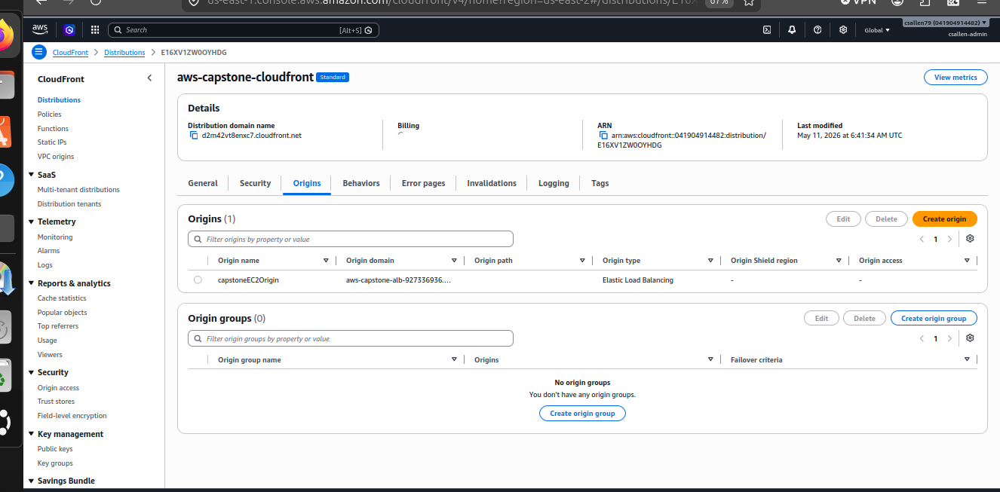

# ☁️ AWS Secure Web App Capstone

## 📌 Overview

In this capstone project, I used Terraform Infrastructure as Code (IaC) to deploy a layered AWS cloud architecture that included CloudFront secure content delivery, an Application Load Balancer (ALB), multiple EC2 web servers, CloudWatch monitoring, and SNS email alerting.

The environment was designed to simulate a production-style AWS deployment with backend redundancy, traffic routing, monitoring, and operational testing.

---

# 🏗️ Architecture

```text
User
 ↓
CloudFront HTTPS CDN
 ↓
Application Load Balancer
 ↓
EC2 Web Server 1
EC2 Web Server 2
```

Monitoring Layer:

```text
CloudWatch Monitoring
↓
SNS Email Alerts
```

---

# ⚙️ Technologies Used

- AWS EC2
- AWS CloudFront
- AWS Application Load Balancer (ALB)
- AWS CloudWatch
- AWS SNS
- Terraform
- Amazon Linux 2023
- Apache Web Server
- Linux SSH Administration

---

# 🔄 How It Works

## ✅ Terraform Infrastructure Deployment

Terraform was used to automate the deployment of:

- EC2 instances
- Security groups
- CloudFront CDN
- Application Load Balancer
- Target groups
- CloudWatch alarms
- SNS email notifications

This allowed the AWS environment to be deployed through Infrastructure as Code instead of manual AWS Console configuration.

---

## ✅ CloudFront Secure Delivery

CloudFront was configured as the frontend CDN layer to provide:

- HTTPS secure delivery
- Improved performance
- Global content delivery
- Public-facing frontend access

Instead of routing traffic directly to EC2, CloudFront forwards requests to the Application Load Balancer.

---

## ✅ Application Load Balancer

The Application Load Balancer distributes traffic between two backend EC2 Apache web servers.

This demonstrates:

- Traffic distribution
- Backend redundancy
- High availability concepts
- Health checks for backend servers

---

## ✅ Multi-Server Backend Infrastructure

Two EC2 web servers were deployed behind the ALB.

This architecture demonstrates:

- Redundant infrastructure
- Load-balanced backend services
- Fault tolerance concepts
- Production-style cloud architecture

---

## ✅ CloudWatch Monitoring and SNS Alerts

CloudWatch alarms were configured to monitor CPU utilization on the EC2 instances.

When CPU thresholds were exceeded:

```text
CloudWatch Alarm
→ SNS Notification
→ Email Alert Sent
```

This demonstrates operational monitoring and alerting workflows commonly used in cloud environments.

---

## ✅ Linux Administration and Operational Testing

Linux administration tasks included:

- SSH access to EC2
- Apache installation and configuration
- CPU stress testing
- Process management
- User management

CPU stress testing was intentionally performed to validate CloudWatch monitoring and SNS alert functionality.

---

# 📸 Screenshots

## CloudFront Secure Webpage


## Load Balancer Listener


## ALB Target Instances


## CloudFront Origin Using ALB


## CloudWatch High CPU Alarm


## CloudWatch Alarm Triggered


## SNS Alert Email


---

# 🧠 Key Takeaways

- Learned how layered AWS architectures function
- Gained hands-on Terraform Infrastructure as Code experience
- Learned how CloudFront integrates with ALB and EC2
- Improved understanding of traffic routing and redundancy
- Learned operational monitoring and alerting concepts
- Improved Linux administration and troubleshooting skills
- Learned how cloud services interact together in a production-style environment

---

# 🎯 Interview Questions

## What was the purpose of using an Application Load Balancer?

The ALB distributes traffic between multiple backend EC2 servers and performs health checks to improve redundancy and availability.

---

## Why was CloudFront used in front of the ALB?

CloudFront provided HTTPS secure delivery, improved performance, and acted as the public-facing frontend layer for the application.

---

## Why deploy multiple EC2 instances?

Multiple EC2 instances improve fault tolerance and allow traffic to continue flowing even if one backend server becomes unavailable.

---

## What was the purpose of CloudWatch and SNS?

CloudWatch monitored infrastructure metrics while SNS automatically sent email alerts when CPU thresholds were exceeded.

---

## Why was Terraform used?

Terraform allowed the infrastructure to be deployed and managed through Infrastructure as Code rather than manual AWS Console configuration.

---

# ✅ Summary

In this capstone project, I built a layered AWS cloud architecture using Terraform, CloudFront, Application Load Balancing, multiple EC2 web servers, CloudWatch monitoring, and SNS alerting.

This project helped reinforce Infrastructure as Code, cloud networking, Linux administration, monitoring, operational testing, traffic routing, and layered cloud architecture concepts in AWS.
